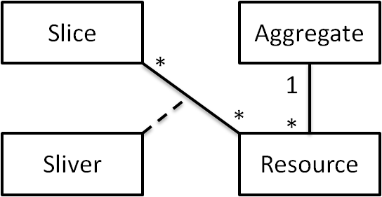

.. _dev-tutorial:

Expedient Plugin Tutorial
#########################

Expedient has two types of plugins that interact with each other:
:ref:`agg-plugins` and :ref:`ui-plugins`. This tutorial will guide through the
process of creation of both types of plugins. You'll first need to install
expedient. Please see :ref:`admin-install`.

.. _agg-plugins:

Aggregate Plugins
=================

Aggregate plugins have three main tasks:

#. Describe resources and their types to the Expedient database
#. Offer an API for other plugins to consume
#. Keep information about resources in an aggregate up-to-date

In this tutorial, we will go through the process of writing a plugin for a
very simple type of aggregate, an SSH access aggregate consisting of a set of
SSH servers. We will write an aggregate plugin that allows
users on Expedient to request SSH access to SSH servers. The admin of the
SSH aggregate will get an email with a message from the user,
information about the user, and a link on Expedient for approving or
denying the request.

If the admin approves the request, the plugin will create a login for the
user on each machine the user asks for, and add a public key provided by the
user. The plugin does that by storing a private key that can be used to login
to the server and execute the required commands.

Preliminaries
-------------

First, make sure that you have Expedient installed and that its packages are
in your python library path (PYTHONPATH environment variable). Then go through
the Django tutorial here_. Create a
package directory called :file:`sshaggregate` with the following files:

* :file:`sshaggregate/__init__.py`: An empty file
* :file:`sshaggregate/models.py`: Will contain descriptions of our resources
* :file:`sshaggregate/views.py`: Will contain the plugin's views

Also the directory hierarchy :file:`sshaggregate/templates/sshaggregate` that
will hold the templates for the plugin.

.. _here: http://www.djangoproject.com/

Writing Models
--------------

There are several models that will need to be written. Mainly, the aggregate
model, the resources' models, and any additional info that needs to be stored.

Edit the :file:`sshaggregate/models.py` so it looks like this:

.. literalinclude:: sshaggregate/models.py
    
Let's go through the code section by section. We use paramiko in order to
communicate with our SSH servers over SSH. Paramiko is a python SSH
library.

SSHServer
.........

The first class in our module is the :class:`SSHServer` class which
extends `Resource`_ class. The `Resource`_ class defines a few common fields
and operations for resources. All resources that can be reserved must inherit
from the `Resource`_ class:

.. literalinclude:: sshaggregate/models.py
   :start-after: # SSHServer class
   :end-before: # SSHServer fields

Most importantly, the resource is related to an
`Aggregate`_ by a foreign key relationship. Take a look at the `Resource`_
class documentation before continuing.

In the :class:`SSHServer` class, we just define
some extra fields and functions. An :class:`SSHServer` instance has an IP
Address and an SSH port number:

.. literalinclude:: sshaggregate/models.py
   :start-after: # SSHServer fields
   :end-before: # end

We also define two extra functions:
:func:`is_alive` and :func:`exec_command`.

.. literalinclude:: sshaggregate/models.py
   :pyobject: SSHServer.is_alive
   
.. literalinclude:: sshaggregate/models.py
   :pyobject: SSHServer.exec_command

The :func:`is_alive` function pings the server and checks that it is up, while
the :func:`exec_command` function executes a command on the server using
:mod:`paramiko`.

SSHServerSliver
...............

A slice (represented by the `Slice`_ class) in Expedient is a container of
slivers of different types of resources and across different
aggregates. A sliver (represented by the generic class `Sliver`_) is the
reservation of one resource instance, and it relates the resource to the
slice. A sliver describes information about the reservation of that particular
instance. For example, if reserving a virtual machine, a sliver might describe
the CPU percentage reserved for the VM.

When an aggregate is about to create a slice across its resources, it looks at
the slice and all the slivers that are for resources it controls. It then uses
those slivers to create the slice. We will see more information on creating a
slice later.

In our example, we don't have any per sliver information, so our
:class:`SSHServerSliver` is empty:

.. literalinclude:: sshaggregate/models.py
   :pyobject: SSHServerSliver

We could have also not created the class at
all, but it makes our code clearer. Take a look at the `Sliver`_ and `Slice`_ classes
documentation before continuing.

SSHSliceInfo
............

Some types of resources might require some per-slice info. In our example,
creating a slice requires a public key for the user, so the SSHSliceInfo class
will store that required information:

.. literalinclude:: sshaggregate/models.py
   :pyobject: SSHSliceInfo

SSHAggregate
............

This is the most involved class. The :class:`SSHAggregate` class extends the
generic `Aggregate`_ class. The `Aggregate`_ class defines some
functions and fields that are shared among all aggregate classes. Aggregate
plugins must always define an Aggregate_ class child.

.. literalinclude:: sshaggregate/models.py
   :start-after: # SSHAggregate class
   :end-before: # SSHAggregate information field

The :class:`SSHAggregate` class overrides the ``information`` field that
contains information about the aggregate and describes the aggregate
type. This field is used in the information page that describes the aggregate
type:

.. literalinclude:: sshaggregate/models.py
   :start-after: # SSHAggregate information field
   :end-before: # SSHAggregate end information field

We have modified the verbose name used in for aggregate to make it easier to
understand what the class is:

.. literalinclude:: sshaggregate/models.py
   :start-after: # SSHAggregate meta
   :end-before: # SSHAggregate end meta

It also adds a ``private_key`` and an ``admin_username`` fields that are used to
login to the servers for administering them. These must be the same for all
servers in the aggregate:

.. literalinclude:: sshaggregate/models.py
   :start-after: # SSHAggregate required fields
   :end-before: # SSHAggregate end required fields

We also have three additional fields that specify the commands that should be
used for creating a user (:func:`add_user_command`), deleting a user
(:func:`del_user_command`), and adding a public key to a user
(:func:`add_pubkey_command`). These commands will be executed in an SSH shell when
creating or deleting users. Make sure that SSH servers you add
allow you to execute these commands non-interactively
(i.e. either login as root or give no-password sudo access to the
commands for the user logging in to execute the commands) :

.. literalinclude:: sshaggregate/models.py
   :start-after: # SSHAggregate optional fields
   :end-before: # SSHAggregate end optional fields

We have also defined some helper functions to add and delete users from
particular server (:func:`add_user` and :func:`del_user`).

.. literalinclude:: sshaggregate/models.py
   :pyobject: SSHAggregate.add_user

.. literalinclude:: sshaggregate/models.py
   :pyobject: SSHAggregate.del_user

These functions use the private method :func:`_op_user`. Note that in case of
error, we post a message to the user:

.. literalinclude:: sshaggregate/models.py
   :start-after: # msg example
   :end-before: # end msg example

This uses the messaging_ module and a utility function
`post_message_to_current_user`_ to post a message to the user indicating an
error has occurred. This message will be shown in the list of messages for the
user.

The :func:`check_status` method overrides the :class:`Aggregate` class's
:func:`check_status` method to also make sure that all the servers in the
aggregate are up by calling their :func:`is_alive` method.

.. literalinclude:: sshaggregate/models.py
   :pyobject: SSHAggregate.check_status

At a minimum any child that inherits from Aggregate_ must override
`start_slice`_ and `stop_slice`_ methods. Our :class:`SSHAggregate` class does
that too:

.. literalinclude:: sshaggregate/models.py
   :start-after: # start_slice func
   :end-before: # start_slice call super

The :func:`start_slice` method calls the parent class's :func:`start_slice`
method because the parent class has some permission checking that we would
rather not copy or redo:

.. literalinclude:: sshaggregate/models.py
   :start-after: # start_slice call super
   :end-before: # start_slice end call super

It then gets needed information about the slice:

.. literalinclude:: sshaggregate/models.py
   :start-after: # start_slice get info
   :end-before: # start_slice get user

And the owner of the slice whose username will be used:

.. literalinclude:: sshaggregate/models.py
   :start-after: # start_slice get user
   :end-before: # start_slice get slivers

Then we get the slivers in the slice that are for resources in the aggregate:

.. literalinclude:: sshaggregate/models.py
   :start-after: # start_slice get slivers
   :end-before: # start_slice end info

Note that we don't just do ``resource__aggregate=self`` because that the
resource is related to :class:`SSHAggregate`'s parent class. So we need to
compare them using ids. We could have instead done
``resource__aggregate=self.aggregate_ptr``.

Now we add the user to the server pointed to by each sliver, keeping track of
our successes for rollback in case of error:

.. literalinclude:: sshaggregate/models.py
   :start-after: # start_slice loop
   :end-before: # Execute the command

The :class:`SSHServerSliver`'s parent class has a pointer to the generic
resource. To obtain the leaf child that the sliver is pointing to, we need to
use a special function. Otherwise, ``sliver.resource`` returns an object of
type generic Resource_:

.. literalinclude:: sshaggregate/models.py
   :start-after: # Execute the command
   :end-before: # start_slice add user

Then we add the user, paying attention to roll back the changes in case of
errors:

.. literalinclude:: sshaggregate/models.py
   :start-after: # start_slice add user
   :end-before: # start_slice end loop

:func:`stop_slice` is very similar to :func:`start_slice` but a bit simpler
since we don't rollback changes in case of errors.

.. literalinclude:: sshaggregate/models.py
   :pyobject: SSHAggregate.stop_slice

Relationships
.............

Below we show a summary of the relationships between slices, resources, aggregates, and slivers.

Each aggregate is connected to a number of resources. Each slice
is also related to a number of resources through a sliver. In our
example, an :class:`SSHAggregate` consists of a number of
:class:`SSHServer` instances. A slice can have a number of
:class:`SSHServerSliver` instances that are each part of an
:class:`SSHServer` instance.

Documenting Code
................

You'll notice that the code we wrote uses something very similar to javadoc
for documenting our methods and classes. We use Epydoc_ for documenting code
and automatically generating API docs from the code. Feel free to use whatever
you like, but please document your code thoroughly.

.. _`Resource`: ../api/expedient.clearinghouse.resources.models.Resource-class.html
.. _`Sliver`: ../api/expedient.clearinghouse.resources.models.Sliver-class.html
.. _`Slice`: ../api/expedient.clearinghouse.slice.models.Slice-class.html
.. _`start_slice`: ../api/expedient.clearinghouse.aggregate.models.Aggregate-class.html#start_slice
.. _`stop_slice`: ../api/expedient.clearinghouse.aggregate.models.Aggregate-class.html#stop_slice
.. _threadlocals: ../api/expedient.common.middleware.threadlocals-module.html
.. _messaging: ../api/expedient.common.messaging-module.html
.. _`post_message_to_current_user`: ../api/expedient.clearinghouse.utils-module.html#post_message_to_current_user
.. _Epydoc: http://epydoc.sourceforge.net/

Writing Views and Templates
---------------------------

The next step is writing some views and HTML templates for
managing the SSH aggregate in Expedient. This includes pages for
adding the aggregate to Expedient or editing it.

Views
.....

The add/edit aggregate view is the page that the user gets
redirected to when she wants
to add an SSH aggregate to Expedient. There will be two steps for adding an
aggregate. In the first, we store information about the aggregate as a
whole. Below, we sketch out what it looks like. We recommend you always sketch
out what your views will look like before writing them::

                                 +-------------------------+
    Admin Username:              |                         |
                                 +-------------------------+
                                 +-------------------------+
    Private Key:                 |                         |
                                 +-------------------------+
                                 +-------------------------+
    Add user command:            |                         |
                                 +-------------------------+
                                 +-------------------------+
    Del user command:            |                         |
                                 +-------------------------+
                                 +-------------------------+
    Add pubkey user command:     |                         |
                                 +-------------------------+

                       +------+
                       | Next | | Cancel
                       +------+

The next view is where the user specifies the SSH servers to add to this
aggregate. All these servers can be administered using the same information
entered in the previous step::

    Add all servers that can be administered using the same information
    here. You can click save to get more rows once you fill the existing
    ones.

    +--------------------------------------------------------+
    |                             +-------------------------+|
    |Name:                        |                         ||
    |                             +-------------------------+|
    |                             +-------------------------+|
    |IP Address:                  |                         ||
    |                             +-------------------------+|
    |                             +-------------------------+|
    |SSH Port:                    |                         ||
    |                             +-------------------------+|
    |                             +-------------------------+|
    |Delete:                      |                         ||
    |                             +-------------------------+|
    +--------------------------------------------------------+
    
    +--------------------------------------------------------+
    |                             +-------------------------+|
    |Name:                        |                         ||
    |                             +-------------------------+|
    |                             +-------------------------+|
    |IP Address:                  |                         ||
    |                             +-------------------------+|
    |                             +-------------------------+|
    |SSH Port:                    |                         ||
    |                             +-------------------------+|
    |                             +-------------------------+|
    |Delete:                      |                         ||
    |                             +-------------------------+|
    +--------------------------------------------------------+

                       +------+ 
                       | Save | | Home
                       +------+ 

These are our two views. We will use a very similar view for
updating aggregates. In fact, we will use the same view with a
minor change: The information about the aggregate would already
be preloaded into the tables. Now, create the file
:file:`sshaggregate/views.py` 
and modify it to look like the following:

.. literalinclude:: sshaggregate/views.py

The :func:`aggregate_crud` function uses the `generic_crud`_
generic view to add or update existing
aggregates. :func:`generic_crud` simplifies many of the
operations that are needed  for creating or updating database
objects. Take a look at `generic_crud`_'s documentation before
continuing.

The :func:`aggregate_add_servers` view uses model formsets. See
the Django documentation about `modelformset_factory`_. It
is a convenient way to create and modify a number of objects:

.. literalinclude:: sshaggregate/views.py
   :lines: 32

Finally when returning a response we should use one of Django's
`generic views`_ because they use `RequestContext`_ when
generating the context for templates. This allows us to use
context processors to add more variables into template contexts,
one of which is the messages that you see at the top of each page:

.. literalinclude:: sshaggregate/views.py
   :lines: 56-58

.. _`generic_crud`: ../api/expedient.common.utils.views-module.html#generic_crud
.. _`generic views`: http://docs.djangoproject.com/en/dev/ref/generic-views/
.. _`modelformset_factory`: http://docs.djangoproject.com/en/dev/topics/forms/modelforms/#model-formsets
.. _`RequestContext`: http://docs.djangoproject.com/en/dev/ref/templates/api/#subclassing-context-requestcontext

Templates
.........

We need three templates:

* :file:`sshaggregate/templates/sshaggregate/sshaggregate_base.html`
* :file:`sshaggregate/templates/sshaggregate/aggregate_crud.html`
* :file:`sshaggregate/templates/sshaggregate/aggregate_add_servers.html`

There is quite a bit that happens behind the scenes in templates,
and there are is a base template that you should use for creating
your own templates. It is a good practice to create a base
template for each plugin or django app from which all other
templates in the plugin or app inherit. Here the base template is
called :file:`sshaggregate_base.html`.

Edit :file:`sshaggregate_base.html` to look like
the following:

.. literalinclude:: sshaggregate/templates/sshaggregate/sshaggregate_base.html

The base right now includes only one line specifying that it
extends the :file:`base.html` template that is used as the base
template for all the templates in Expedient. The base template
has a few style headers and some javascript code that does magic
like changing help text in tables that have the ``formtable``
class into a question mark. You will see it in action here.

Next edit the :file:`aggregate_crud.html` file to look like the
following:

.. literalinclude:: sshaggregate/templates/sshaggregate/aggregate_crud.html

Let's go through the file. We want our template to extend our
plugin's base template:

.. literalinclude:: sshaggregate/templates/sshaggregate/aggregate_crud.html
   :lines: 1

Expedient's base template :file:`base.html` has a number of
blocks that can be extended.

* ``title``: Gets used as the page's title.
* ``head``: Any code in this block is added to the ``<head>``
  element in the html document. You can use this space to add
  javascript or css style blocks.
* ``content``: This is where you should put your template's
  body.

We set the title:

.. literalinclude:: sshaggregate/templates/sshaggregate/aggregate_crud.html
   :lines: 3

There's nothing in the head:

.. literalinclude:: sshaggregate/templates/sshaggregate/aggregate_crud.html
   :lines: 5-6

Then our content start:

.. literalinclude:: sshaggregate/templates/sshaggregate/aggregate_crud.html
   :lines: 8-9

We specified that the template object name is ``aggregate`` when
we used the :func:`generic_crud` function. So if it is specified
in the template, it means that the template is being used to
update an existing instance:

.. literalinclude:: sshaggregate/templates/sshaggregate/aggregate_crud.html
   :lines: 10-11

Otherwise, we are creating a new instance:

.. literalinclude:: sshaggregate/templates/sshaggregate/aggregate_crud.html
   :lines: 12-14

We then add the form to get the info about the aggregate:

.. literalinclude:: sshaggregate/templates/sshaggregate/aggregate_crud.html
   :lines: 15-28

Note that we use the ```` tag because Django's
CSRF protection is enabled. Also note that we give the table in
the form the ``formtable_noborder`` class which defines some css
settings and lets javascript do its magic in moving help text
into balloon tips.

Next, create the
:file:`sshaggregate/templates/sshaggregate/aggregate_add_servers.html`
and edit it to look like the following:

.. literalinclude:: sshaggregate/templates/sshaggregate/aggregate_add_servers.html

This is similar to :file:`aggregate_crud.html`, so we won't go
through it in detail.

Connecting to Expedient
-----------------------

To add the plugin to Expedient, there are a few things we need to
do:

#. Write the URLs
#. Modify Expedient settings to include the plugin

Write the URLs
..............

Create the file :file:`sshaggregate/urls.py` and edit it to look
like the following:

.. literalinclude:: sshaggregate/urls.py

We need three urls:

* Creating the aggregate
* Updating the aggregate
* Adding/removing servers from the aggregate

The Aggregate_ class by default expects the create and
update urls to have a particular format:
``<app_name>_aggregate_create`` and
``<app_name>_aggregate_update``. If the plugin specified an
additional URL ``<app_name>_aggregate_delete``, the user would be
redirected to that URL when requesting to delete the aggregate
instead of the default deletion confirmation page.

Note that for both the create and update, we use the same
:func:`aggregate_crud` function. In the create url, it will be
called with no arguments, while in the edit url, it will be
called with the ``agg_id`` argument.

Update Settings
...............

First, we need to add the plugin to the list of installed
apps. Edit your :file:`localsettings.py` file to do
so. Eventually, if the plugin makes it into the Expedient
distribution, the settings that you modify here will be added to
the default settings. We will need to edit two settings.

Default Settings
^^^^^^^^^^^^^^^^

All the settings you put in the :file:`localsettings.py` appear in Django's
:mod:`settings` module. So if your application has some default settings that
you would like to add, you will need to add a line similar to::

    from sshaggregate.defaultsettings import *

at the top of the :file:`localsettings.py` file. 

You can append additional list items to almost all of the default
settings that are lists. Below we show an example of how this is
done for `INSTALLED_APPS`_ and `AGGREGATE_PLUGINS`_. If
you add an `EXTRA_` at the beginning of the name, the list you
specify next is appended to the setting's list value.

INSTALLED_APPS
^^^^^^^^^^^^^^

Add the following line to your :file:`localsettings.py`::

    EXTRA_INSTALLED_APPS = [
        'sshaggregate',
    ]

AGGREGATE_PLUGINS
^^^^^^^^^^^^^^^^^

The `AGGREGATE_PLUGINS`_ setting describes the aggregate plugins
that are installed. See the `AGGREGATE_PLUGINS`_ setting
documentation for more information::

    EXTRA_AGGREGATE_PLUGINS = [
        ('sshaggregate.models.SSHAggregate', 'sshaggregate', 'sshaggregate.urls'),
    ]

.. _`Aggregate`: ../api/expedient.clearinghouse.aggregate.models.Aggregate-class.html
.. _`AGGREGATE_PLUGINS`: ../api/expedient.clearinghouse.defaultsettings.expedient-module.html#AGGREGATE_PLUGINS

Testing
-------

Now, you will need to test your plugin to make everything
works. The first phase of testing is going to be manual
prelimiary testing to make sure that the plugin works
well. Before you do so, make sure that you have performed a
``manage.py syncdb`` on the running Expedient instance that you
will use. Here we will cover automated testing.

The importance of automated testing cannot be stressed enough. Anytime you
make a change, you will need to run the tests, and nothing makes your job of
fixing bugs and adding new features as easy as automated tests.
Django has extensive facilities for testing that come in quite
handy. Create the :file:`sshaggregate/tests.py` and edit it to
look like the following:

.. literalinclude:: sshaggregate/tests.py

The tests that we have written test two things:

* Adding an SSH aggregate to Expedient
* Creating and deleting a slice

This is not a comprehensive test suite, and your tests should include more
exhaustive testing. The test class does the following. It first sets up the
environment by creating an SSH key for the user running the test, adding it to
the user's authorized keys, and using the user as the admin for the
aggregate. The tests can now SSH into localhost using the created key.

When adding an aggregate the test suite uses custom commands for creating
users, deleting users, and adding a public key to a user's account. Instead of
these commands actually doing what they are supposed to do, we do the
following. When creating a user, we write the user's username into a temprary
file and we write the user's public key into another file. Then we check that
the commands executed correctly and that these files were written as
expected. Similarly, when deleting a user, we write the user's username into a
temporary file and we check that the file was written as expected.
So let's go through the test code section by section.

First, we create a class that inherits from the :class:`django.test.TestCase`:

.. literalinclude:: sshaggregate/tests.py
   :start-after: # Tests class
   :end-before: # start constants

Expedient also provides a different class you can inherit from,
`expedient.common.tests.manager.SettingsTestCase`_. This test case allows you
to easily change settings in the test case to, for example, add new
django apps that are used in testing. Take a look at
`expedient.clearinghouse.aggregate.tests.tests`_ for an example on how it is
used.

Next, we define some constants that are used in testing. These are the names
of the temporary files used and information about the temporary SSH key
created for the tests:

.. literalinclude:: sshaggregate/tests.py
   :start-after: # start constants
   :end-before: # end

Next, we define a method to create an SSH key and add it to the current user's
:file:`authorized_keys` file. This function uses :mod:`paramiko` to generate a
key.

.. literalinclude:: sshaggregate/tests.py
   :pyobject: Tests.create_test_ssh_key

Note that we've given the key a special comment that we can use to
delete the key in the :func:`delete_test_ssh_key` method:

.. literalinclude:: sshaggregate/tests.py
   :pyobject: Tests.delete_test_ssh_key

The :func:`setUp` function first creates a local user:

.. literalinclude:: sshaggregate/tests.py
   :start-after: # create local user
   :end-before: # end

We chose to create a superuser because it bypasses some of the security
restrictions built into Expedient. You might want to do the testing with a
regular user instead. Then we disable permission checking in Expedient:

.. literalinclude:: sshaggregate/tests.py
   :start-after: # disable permissions
   :end-before: # end

This disables most of the permission checks that Expedient performs. In more
exhaustive testing, you will want to keep permissions enabled. Then we create
an ssh key to ssh into localhost:

.. literalinclude:: sshaggregate/tests.py
   :start-after: # create ssh key
   :end-before: # end

And finally we log in as the user we just created so we can use Django's test
client to make html requests:

.. literalinclude:: sshaggregate/tests.py
   :start-after: # login user
   :end-before: # end

The :func:`tearDown` function does many of :func:`setUp`'s operations
in reverse:

.. literalinclude:: sshaggregate/tests.py
   :pyobject: Tests.tearDown

Adding Aggregates
.................

The first test checks that we can add an aggregate:

.. literalinclude:: sshaggregate/tests.py
   :start-after: # add aggregate tests
   :end-before: # end

Make sure that nothing is in Expedient already:

.. literalinclude:: sshaggregate/tests.py
   :start-after: # check nothing is there
   :end-before: # end

Get the private key that we created as a string to use in adding the
aggregate:

.. literalinclude:: sshaggregate/tests.py
   :start-after: # get private key as string
   :end-before: # end

Then we add the aggregate using an html post request using django's
client. Note that here we use a custom function `test_get_and_post_form`_ that
gets a form, and fills in some of the parameters. We use this function to save
some of the trouble of having to add fields with existing defaults or for
fields that are arriving from the server with custom values. After we do the
post request, we check that the aggregate has indeed been added.

.. literalinclude:: sshaggregate/tests.py
   :start-after: # Add the aggregate
   :end-before: # end

Note the custom commands we have used to add a user, delete a user, and add a
public key to a user. We also need to check that after adding the aggregate we
were redirected to the page where we add servers:

.. literalinclude:: sshaggregate/tests.py
   :start-after: # where do we go next?
   :end-before: # end

Now we add the localhost as a server in the aggregate:

.. literalinclude:: sshaggregate/tests.py
   :start-after: # Add the localhost as a server
   :end-before: # end

And finally we check that the server was added correctly:

.. literalinclude:: sshaggregate/tests.py
   :start-after: # check that localhost added
   :end-before: # end

Creating and Deleting Slices
............................

Next we check that functionality of our aggregate.

.. literalinclude:: sshaggregate/tests.py
   :start-after: # slice tests
   :end-before: # end

We call the previous function to add the aggregate to Expedient first.

.. literalinclude:: sshaggregate/tests.py
   :start-after: # Add the aggregate
   :end-before: # end

Then we create a project.

.. literalinclude:: sshaggregate/tests.py
   :start-after: # Create the project
   :end-before: # end

We add the aggregate to the project, and we check that the project now has the
aggregate:

.. literalinclude:: sshaggregate/tests.py
   :start-after: # Add the aggregate to the project
   :end-before: # end

Then we create the slice:

.. literalinclude:: sshaggregate/tests.py
   :start-after: # Create the slice
   :end-before: # end

We add the aggregate to the slice, and check that the addition worked.

.. literalinclude:: sshaggregate/tests.py
   :start-after: # Add the aggregate to the slice
   :end-before: # end

Now, if you recall, slices are composed of slivers. To tell Expedient that we
want an SSHServer from a particular aggregate in our slice, we need to a
create a sliver for that resource. We do this by creating an
:class:`SSHServerSliver` instance:

.. literalinclude:: sshaggregate/tests.py
   :start-after: # Create a sliver
   :end-before: # end

Next we add more information about the slice using the :class:`SSHSliceInfo`
class:

.. literalinclude:: sshaggregate/tests.py
   :start-after: # Create the SSHSliceInfo
   :end-before: # end

Now we can start the slice:

.. literalinclude:: sshaggregate/tests.py
   :start-after: # Start the slice
   :end-before: # end

Now we need to check that the command to add users was executed correctly on
the localhost. We do this by checking that the username was written correctly
to the temporary file.

.. literalinclude:: sshaggregate/tests.py
   :start-after: # Check that the add command was executed correctly
   :end-before: # end

We do a similar check to see that the public key for the user was added:

.. literalinclude:: sshaggregate/tests.py
   :start-after: # check that the add pub key command executed correctly
   :end-before: # end

Next, we stop the slice:

.. literalinclude:: sshaggregate/tests.py
   :start-after: # Stop the slice
   :end-before: # end

And we make sure that the command executed correctly:

.. literalinclude:: sshaggregate/tests.py
   :start-after: # Check that the del user command executed correctly
   :end-before: # end

And that's it. You now have a basic test suite that you can run. To run the
test, you need to make sure that :mod:`sshaggregate` is in your
PYTHONPATH. Then you can use the :command:`test` management command to run the
:mod:`sshaggregate` test suite.

.. _`expedient.common.tests.manager.SettingsTestCase`: ../api/expedient.common.tests.manager.SettingsTestCase-class.html
.. _`expedient.clearinghouse.aggregate.tests.tests`: ../api/expedient.clearinghouse.aggregate.tests.tests-module.html
.. _`test_get_and_post_form`: ../api/expedient.common.tests.client-module.html#test_get_and_post_form
